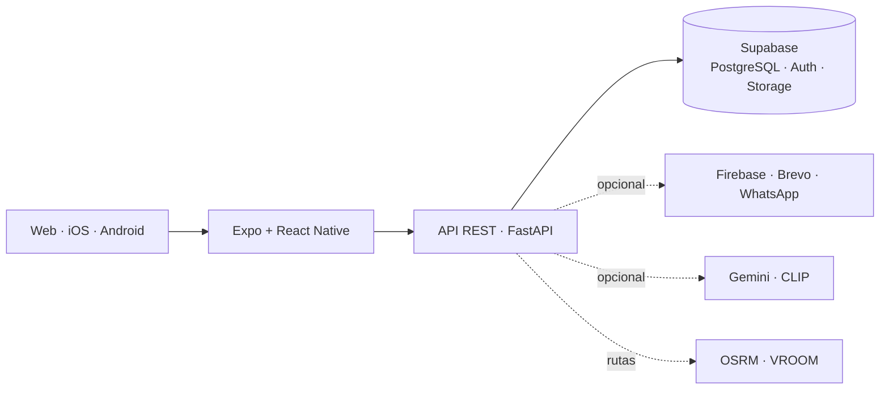

<p align="center">
  
</p>

<h1 align="center">PawAlert</h1>

<p align="center">
  Una red digital para reportar animales en riesgo y coordinar su atención de principio a fin.
</p>

PawAlert conecta a ciudadanía, voluntariado, asociaciones de rescate y aliados locales en un mismo flujo. La plataforma permite levantar un reporte con evidencia y ubicación, encontrar a las personas adecuadas para atenderlo y dar seguimiento al caso sin perder de vista la seguridad ni la privacidad de quienes participan.

El proyecto funciona como aplicación web progresiva y como app para iOS y Android. El frontend está construido con Expo y React Native; la operación, los permisos y las reglas del dominio viven en una API de FastAPI respaldada por Supabase.

## ¿Qué problema resolvemos?

Cuando aparece un animal herido o abandonado, la información suele quedar repartida entre publicaciones, mensajes y llamadas. Esto complica saber quién puede ayudar, qué ocurrió después y quién tiene la responsabilidad del caso.

PawAlert convierte ese aviso aislado en un proceso coordinado:

1. Una persona registra uno o varios animales con fotografías y ubicación.
2. El sistema valida el reporte, identifica posibles duplicados y busca cobertura disponible.
3. Una asociación coordina la atención y asigna a su equipo o solicita apoyo externo.
4. Los hitos del rescate, la custodia y el resultado quedan documentados para las personas autorizadas.

## Funcionalidades principales

- **Reportes geolocalizados:** casos con uno o varios animales, con o sin cuenta, fotografías, condición, ubicación y referencias del sitio.
- **Mapa operativo:** consulta de reportes, zonas y eventos, con experiencias adaptadas para web y dispositivos móviles.
- **Coordinación de rescates:** asignación por cobertura y capacidades, confirmaciones, escalamiento y seguimiento por hitos.
- **Navegación del caso:** ruta privada para el voluntario asignado, modos de traslado y recálculo ante desvíos.
- **Voluntariado y custodia temporal:** postulaciones, disponibilidad operativa, capacidades, relevos y verificaciones del hogar.
- **Avistamientos:** nueva evidencia geográfica y visual para casos de animales no localizados, con revisión por asociación.
- **Adopciones responsables:** perfiles, requisitos, solicitudes, selección, entrega y seguimiento posterior, sin confundir la adopción con el cierre de una custodia.
- **Eventos de asociaciones:** publicación, mapa, eventos guardados, recordatorios y moderación de actividades comunitarias.
- **Red de Aliados:** donaciones, servicios, lotes compartidos, recepción mediante QR y recompensas para la comunidad.
- **Confianza y reconocimiento:** reputación, insignias e historial de participación para reportantes, voluntarios y aliados.
- **Administración y moderación:** validación de asociaciones, atención de incidentes y control de contenido sensible.
- **Notificaciones:** avisos dentro de la app y soporte para push, correo y WhatsApp cuando las integraciones están configuradas.

## Participantes de la red

| Perfil                     | Participación dentro de PawAlert                                                           |
| -------------------------- | ------------------------------------------------------------------------------------------ |
| Reportante                 | Registra casos, aporta evidencia y consulta su seguimiento.                                |
| Voluntario de asociación   | Atiende los reportes coordinados por la organización a la que pertenece.                   |
| Voluntario externo         | Apoya en rescates cercanos o brinda custodia temporal según sus capacidades.               |
| Asociación                 | Recibe alertas, coordina rescates, administra a su equipo, adopciones y eventos.           |
| Donante comunitario        | Ofrece una aportación puntual a una necesidad publicada.                                   |
| Aliado local               | Aporta productos o servicios recurrentes, como atención veterinaria, transporte o insumos. |
| Patrocinador institucional | Colabora mediante recursos, campañas o apoyos de mayor alcance.                            |
| Administración             | Verifica organizaciones, modera contenido y supervisa la operación general.                |

Los permisos sensibles se validan en el backend; ocultar una acción en la interfaz nunca es la única barrera de acceso.

## Arquitectura



Las integraciones secundarias están aisladas del flujo principal. Una falla al enviar una notificación, por ejemplo, no debe impedir que un rescate o una actualización queden confirmados.

## Tecnologías

| Capa               | Herramientas                                                    |
| ------------------ | --------------------------------------------------------------- |
| Aplicación         | Expo 54, React Native 0.81, React 19, Expo Router y TypeScript  |
| Web y mapas        | React Native Web, Leaflet, React Leaflet y CARTO                |
| Backend            | FastAPI, Python y Pydantic                                      |
| Datos              | Supabase: PostgreSQL, Auth y Storage                            |
| Notificaciones     | Firebase Cloud Messaging, Brevo, Twilio y WhatsApp Cloud API    |
| Rutas y asignación | OSRM y VROOM                                                    |
| Apoyo visual       | Gemini y embeddings CLIP configurables                          |
| Calidad            | Jest, Testing Library, Pytest y Playwright                      |
| Despliegue         | Vercel para la PWA y Railway para la API y procesos programados |

## Estructura del repositorio

```text
PawAlert-PWA/
├── src/
│   ├── app/             # Rutas con Expo Router
│   ├── screens/         # Pantallas y flujos principales
│   ├── components/      # Componentes compartidos y paneles por rol
│   ├── hooks/           # Acceso a datos y lógica reutilizable
│   ├── services/        # Clientes del backend e integraciones del frontend
│   ├── context/         # Sesión y estado global
│   └── types/           # Contratos TypeScript
├── backend/
│   ├── app/api/         # Endpoints REST
│   ├── app/services/    # Reglas de negocio
│   ├── app/models/      # Esquemas de entrada y respuesta
│   ├── migrations/      # Evolución del esquema de Supabase
│   └── tests/           # Pruebas del backend
├── e2e/                 # Flujos críticos con Playwright
├── docs/                # Contratos funcionales y técnicos
├── public/              # Manifest, iconos y recursos de la PWA
└── assets/              # Recursos visuales de la aplicación
```

## Puesta en marcha local

### Requisitos

- Node.js 20 LTS o superior y npm.
- Python 3.13 o superior.
- Un proyecto de Supabase con las migraciones y buckets del proyecto configurados.
- Para ejecutar iOS o Android, el entorno nativo correspondiente de Expo.

### 1. Instalar el frontend

```bash
git clone https://github.com/danielalira20/PawAlert-PWA.git
cd PawAlert-PWA
npm install
cp .env.example .env
```

Completa en `.env` la URL y la clave pública `anon` de Supabase. Las variables públicas de Firebase habilitan las notificaciones web y la clave de CARTO habilita las teselas del mapa. Ninguna credencial administrativa debe llevar el prefijo `EXPO_PUBLIC_`.

Inicia la plataforma que quieras probar:

```bash
npm run web
npm run android
npm run ios
```

Para abrir la app desde un teléfono conectado a la misma red, actualiza `LOCAL_IP` en `src/constants/api.ts` con la dirección de la computadora que ejecuta el backend. En web, el entorno de desarrollo utiliza `http://localhost:8000`.

### 2. Instalar el backend

Desde la raíz del repositorio:

```bash
python3 -m venv backend/venv
source backend/venv/bin/activate
pip install -r backend/requirements.txt
cp backend/.env.example backend/.env
cd backend
uvicorn app.main:app --reload
```

La API queda disponible en `http://127.0.0.1:8000`; su documentación interactiva se encuentra en `http://127.0.0.1:8000/docs` y el estado del servicio en `http://127.0.0.1:8000/health`.

En `backend/.env` son indispensables `SUPABASE_URL`, `SUPABASE_KEY` y `SUPABASE_SERVICE_KEY`. También deben existir los buckets indicados en el archivo de ejemplo. Las migraciones de `backend/migrations/` son SQL versionado y no se ejecutan automáticamente.

### Integraciones opcionales

El archivo `backend/.env.example` documenta las variables disponibles para:

- Firebase Admin y entrega de notificaciones push.
- Brevo para correo transaccional.
- Twilio y WhatsApp Cloud API para avisos y reportes conversacionales.
- Gemini para revisión asistida de fotografías y recorridos en video.
- OpenWeather para señales meteorológicas.
- OSRM y VROOM para rutas, tiempos estimados y optimización de asignaciones.
- Un endpoint de Hugging Face para similitud visual con CLIP.

Las llaves privadas, la cuenta de servicio de Firebase y la clave `service_role` de Supabase pertenecen exclusivamente al backend.

## Validación

Frontend:

```bash
npm test -- --runInBand
npm run lint
npx tsc --noEmit
npm run build
```

Backend:

```bash
cd backend
venv/bin/python -m pip install -r tests/requirements.txt
venv/bin/python -m pytest
```

Flujos end-to-end:

```bash
cp .env.e2e.example .env.e2e
set -a
source .env.e2e
set +a
npm run test:e2e
```

Las pruebas E2E que escriben datos solo deben apuntar a un entorno local, de pruebas o de vista previa. Consulta [TESTING.md](TESTING.md) para preparar las cuentas y habilitar esas escrituras de forma explícita.

## Documentación técnica

- [Backend y variables de entorno](backend/README.md)
- [Estrategia de pruebas](TESTING.md)
- [Cobertura y estado de validación](REPORTE_PRUEBAS_Y_COBERTURA.md)
- [Flujo de voluntariado externo](docs/flujo-voluntarios-externos.md)
- [Contrato de adopciones](docs/contrato-adopciones.md)
- [Contrato de eventos](docs/contrato-eventos-asociacion.md)
- [Navegación del caso asignado](docs/contrato-navegacion-caso-asignado.md)
- [Red de Aliados y canjes QR](docs/contrato-canjes-qr.md)
- [Similitud visual](docs/contrato-similitud-visual.md)

## Seguridad y privacidad

- Las fotografías, ubicaciones, teléfonos y datos de voluntariado se tratan como información sensible.
- Las ubicaciones operativas de rescate y custodia no forman parte de las respuestas públicas.
- Los endpoints sensibles comprueban sesión, rol, propiedad y estado del recurso.
- Los procesos programados utilizan un secreto independiente mediante `X-Cron-Secret`.
- Los archivos `.env`, tokens y credenciales privadas no deben subirse al repositorio.

---

PawAlert nace de una idea sencilla: que pedir ayuda para un animal no termine en una publicación olvidada, sino en una red capaz de responder y dar seguimiento.
